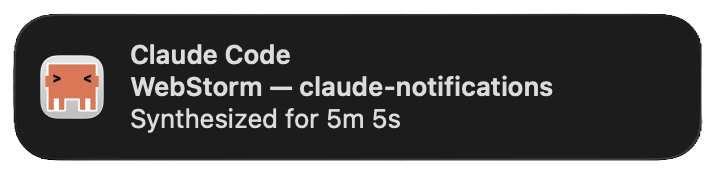

<p align="center">

</p>

# Claude Notifications

Focus-aware macOS notifications for [Claude Code](https://claude.com/claude-code): suppresses when you're already looking at the session's terminal, dedupes across parallel sessions, and shows turn duration on Stop ("Wrangled for 3m 5s").

Claude Code ships without default `Notification`/`Stop` hooks — you wire in whatever you want. This repo is what I wire in on macOS. If you're on a different platform or want something a little different, the design is portable — see [Adapting to your setup](#adapting-to-your-setup).



## Features

- **Focus suppression.** If the source app (Warp, WebStorm, VS Code, iTerm, …) is already frontmost, no notification fires. You only get pinged when you're actually away.
- **Per-session dedup.** Suppress keys are scoped to `(bundle id, working dir)`, so a Stop firing in one repo won't silence another session running in a different app or directory.
- **Turn duration on Stop.** Body reads `<past-tense verb> for <duration>` — "Crunched for 57s", "Pondered for 3m 5s". Duration is derived from the session transcript, not wall-clock since the hook fired.
- **Source-app detection.** Reads `$TERM_PROGRAM` and `$__CFBundleIdentifier` to map the session back to Warp, iTerm, Terminal, VS Code, or any JetBrains IDE. Click the notification → that app activates.
- **Custom icon.** `ClaudeCodeNotifier.app` is a rebranded [`terminal-notifier`](https://github.com/julienXX/terminal-notifier) with the Claude icon. `notify.sh` falls back to `osascript` if the app isn't installed, so nothing breaks without it.
- **Optional Warp window titles.** If [yabai](https://github.com/koekeishiya/yabai) is installed, the Warp tab title appears in the notification subtitle instead of just the repo name.

## Requirements

- macOS. Uses `lsappinfo`, `osascript`, `afplay`, `md5`.
- [`jq`](https://jqlang.github.io/jq/) — `brew install jq`. Required by both `install.sh` and `notify.sh` (transcript parsing).
- Optional: [yabai](https://github.com/koekeishiya/yabai) for Warp window-title context.
- Optional: the [Warp focus handler](./warp-focus-handler/) if you want `claude-focus://` URLs to pop the right Warp tab.

## Install

```bash
git clone https://github.com/sulcer/claude-notifications.git
cd claude-notifications
./install.sh
```

What it does:

- Backs up `~/.claude/settings.json` to `settings.json.bak.<unix-ts>`.
- Merges the three hook entries from `settings.example.json` into your existing hooks (idempotent — re-running is safe; matching `command` strings are skipped).
- Copies `notify.sh` to `~/.claude/notify.sh`. If a different `notify.sh` already exists there, install aborts — pass `--force` to overwrite (backed up first).
- If `ClaudeCodeNotifier.app` isn't already in `~/.claude/`, runs `build-notifier.sh` to fetch + rebrand `terminal-notifier` 2.0.0 and installs it. Build failure is non-fatal — `notify.sh` falls back to `osascript`.

Restart Claude Code (or start a new session) to pick up the hooks.

## How it works

Three hooks cooperate:

| Hook | Fires when | What it does |
| --- | --- | --- |
| `Notification` | Claude is waiting on you (permission prompt, idle) | Shows "Claude Code needs your attention" unless suppressed |
| `Stop` | A turn ends | Shows `<random verb> for <duration>` — e.g. "Pondered for 2m 11s" |
| `UserPromptSubmit` | You send a prompt | Invokes `notify.sh --clear` — removes this session's suppress dir so the next Notification can fire |

**Suppress dirs** (`/tmp/claude-notify-suppress-<md5>`) do two jobs at once:

1. **Atomic first-fire lock.** `mkdir` is atomic, so whichever of Stop/Notification reaches it first wins — duplicates exit silently.
2. **Per-session keying.** The hash is `md5(bundle_id + PWD)`, so a Stop in `~/repos/a` running inside Warp doesn't silence a sibling session in `~/repos/b` running inside WebStorm. Each session has its own key, and each `UserPromptSubmit` clears only its own.

A once-per-minute sweep removes suppress dirs older than 5 minutes so nothing leaks if a session dies mid-turn.

**Turn duration** is read from the session transcript, not from the hook's wall-clock. `notify.sh` scans for the last user message with a `permissionMode` field (real prompts have it; slash-commands, injected context, and tool results don't) and subtracts its timestamp from `now`. This avoids undercounting when the transcript flush races the Stop hook.

## Adapting to your setup

The macOS bits are isolated — the rest of the design is portable.

**macOS-specific, rewrite for your platform:**

- Frontmost check (`lsappinfo` / `osascript -e 'tell application "System Events"…'`)
- Notifier binary (`terminal-notifier` + `osascript display notification` fallback)
- Sound playback (`afplay`)
- Hash (`md5`)
- yabai window-title lookup (Warp-specific; delete if you don't use Warp + yabai)
- `ClaudeFocusHandler.app` (Warp + AppleScript; irrelevant off macOS)

**Portable, keep as-is:**

- The three-hook pattern (Notification / Stop / UserPromptSubmit `--clear`)
- The suppress-dir dedup + per-`(app, dir)` keying
- The once-per-minute TTL sweep
- The transcript-parsing duration logic (`permissionMode`-filtered user messages)
- The random past-tense verb pool
- The source-app detection heuristic (swap bundle IDs for whatever identifiers your platform exposes)

**Linking this repo to Claude Code.** The fastest way to port this to your setup is to clone this repo, open it in Claude Code, and ask:

> "Adapt `notify.sh` for Linux with `notify-send` and ALSA / Windows with BurntToast / WSL / tmux / whatever. Keep the three-hook pattern, the suppress-dir dedup, and the transcript duration logic. Replace the macOS-specific primitives."

`notify.sh` is commented with its design intent specifically so an LLM can rewrite the platform primitives without losing the behavior.

## Customization

- **Sounds.** Edit the `notify.sh ''` lines in `~/.claude/settings.json` to point at any `.aiff`/`.wav`. `/System/Library/Sounds/` has the built-in macOS sounds.
- **Verbs.** The `STOP_VERBS=(…)` array in `notify.sh` is the pool for Stop bodies — add, remove, or replace.
- **Source apps.** Extend the `case "$TERM_PROGRAM"` / `case "$BUNDLE_ID"` branches in `notify.sh` for editors that aren't already detected.
- **Icon.** Drop your own `Terminal.icns` into `icon/` and re-run `./build-notifier.sh` to rebuild the `.app` bundle.

## Uninstall

```bash
./uninstall.sh
```

Removes only the three hook entries whose `command` references `~/.claude/notify.sh`. Any other hooks you've added are left alone. `notify.sh` and `ClaudeCodeNotifier.app` stay in `~/.claude/` (other tooling may reference them); the script prints the manual `rm` lines if you want to fully clean up.

## Warp focus handler

Optional. Registers a `claude-focus://<action>/<id>` URL scheme that pops the right Warp tab via the Navigation Palette. Useful if you're clicking notifications from a browser or chat app and want them to land in a specific tab, not just "Warp, frontmost."

See [`warp-focus-handler/`](./warp-focus-handler/).

## Credits

- [`terminal-notifier`](https://github.com/julienXX/terminal-notifier) by Eloy Durán and Julien Blanchard (MIT). `build-notifier.sh` downloads the official 2.0.0 release and rebrands the `Info.plist` + icon; the binary itself is unmodified.
- License: [MIT](./LICENSE).
